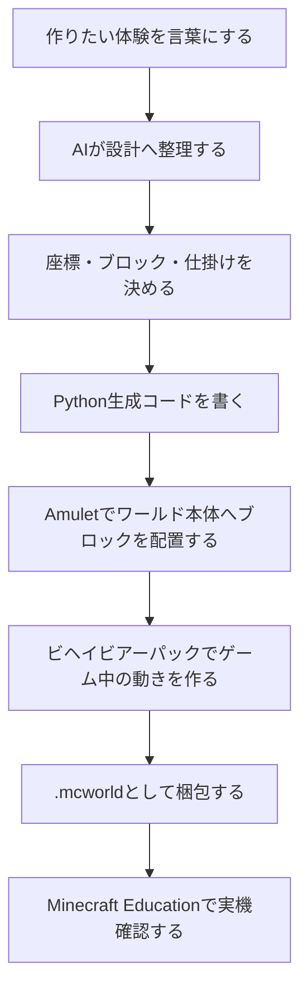
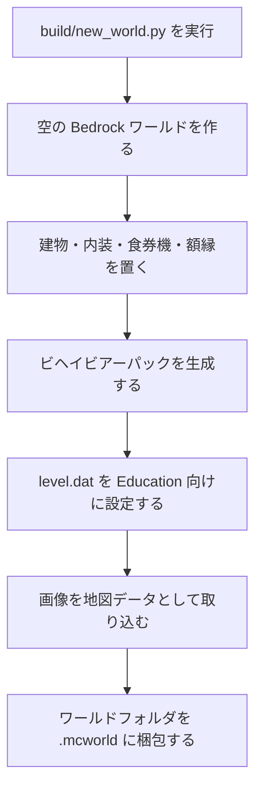
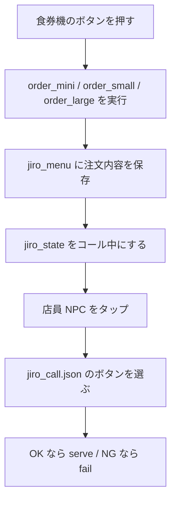

この前、[MineCraft Education（教育版マインクラフト）](https://education.minecraft.net/)で遊んでいたところ、ふと「マイクラのワールドを AI で作れたら面白いかも」と思いました ⭒🦭꩜.ᐟ

かくいう私はマイクラ動画をみるのは好きなのですが（映画も好き）、ブロックをつむのが~~~めんどう~~~というか、レゴも苦手なタイプなので、自分の手で建築するのはもってのほか人間なのです・・

なので、今回は AI にちいかわの「郎」みたいなラーメン屋さんのワールドを作ってもらいました 🍜🍜
微調整含めて、1-2 日くらいでできたと思います。

この記事の内容に直接関係しそうな公式ページだけ置いておきます。

- [.mcworld のインポート・エクスポート: Import, Export, and Manage Worlds](https://edusupport.minecraft.net/hc/en-us/articles/360047555391-Import-Export-and-Manage-Worlds)
- [Bedrock Add-On の置き場所や構成: Getting Started with Add-On Development for Bedrock Edition](https://learn.microsoft.com/minecraft/creator/documents/gettingstarted?view=minecraft-bedrock-stable)
- [ビヘイビアーパックの基本: Introduction to Behavior Packs](https://learn.microsoft.com/minecraft/creator/documents/behaviorpackfromscratch?view=minecraft-bedrock-stable)
- [パック内に置けるファイル一覧: Comprehensive List of Add-On Pack Contents](https://learn.microsoft.com/minecraft/creator/documents/comprehensivepackcontents?view=minecraft-bedrock-stable)
- [mcfunction の基本: Introduction to Functions](https://learn.microsoft.com/minecraft/creator/documents/functionsintroduction?view=minecraft-bedrock-stable)
- [コマンド全般: Commands documentation](https://learn.microsoft.com/minecraft/creator/commands/?view=minecraft-bedrock-stable)
- [ターゲットセレクター: Target Selectors](https://learn.microsoft.com/minecraft/creator/documents/targetselectors?view=minecraft-bedrock-stable)
- [状態管理に使った scoreboard: `/scoreboard` Command](https://learn.microsoft.com/minecraft/creator/reference/content/commandsreference/examples/commands/scoreboard?view=minecraft-bedrock-stable)
- [NPC の分岐会話 JSON: NPC Dialogue Command](https://learn.microsoft.com/minecraft/creator/documents/npcdialogue?view=minecraft-bedrock-stable)
- [NPC 会話の割り当て: `/dialogue` Command](https://learn.microsoft.com/minecraft/creator/commands/commands/dialogue?view=minecraft-bedrock-stable)
- [教育版の NPC 機能: Adding Non-Player Characters (NPCs)](https://edusupport.minecraft.net/hc/en-us/articles/360047555651-Adding-Non-Player-Characters-NPCs)
- [展示ワールドを守る特殊ブロック: Specialty Blocks (Allow, Deny, Border, Structure)](https://edusupport.minecraft.net/hc/en-us/articles/360047116852-Specialty-Blocks-Allow-Deny-Border-Structure)
### コール体験
券売機で「ミニ」「小」「大」を選んで、店員 NPC にコールします


※ このお店のラインナップは、ちいかわラーメン「豚」の店舗に準拠しています

https://cafe.parco.jp/event/information/chiikawaramenbuta_shibuya?area=029979


正しいコールが選べるとラーメン（ビートルートスープ）がインベントリに入ります
間違ったコールをすると、モモンガのように店から追い出されてしまいます


### 歴史学習スポット（教育要素。笑）
"教育版"マインクラフトなので、二郎系ラーメンの歴史を学べるスポットも作りました。NPC に話しかけると、二郎系ラーメンの歴史を学べます


・・・で、正直このくらいしかやっていないのですが、せっかくなので GPT-5.5 くんに自分が何をしたのかまとめてもらいました。ずいぶんと長いですが、仕組みを知りたい方はご参考までに ҂ ꒷🏭 ˚.

---
（以下、GPT-5.5 くん執筆）

## この記事でまとめること 🧭

- `.mcworld` が何で構成されているのか
- AI と一緒に作るなら、どこを AI に任せるのか
- 今回のプロジェクトでは、どの Python が何を作っているのか
- 最終的にどう `.mcworld` へ梱包しているのか
- 同じようなワールドを作るなら、AI にどう指示するとよさそうか

## まず結論 🌟

AI で Minecraft Education のワールドを作るなら、いきなり「完成した `.mcworld` を作って」と頼むより、次の形にした方が安定しやすいです。



AI に頼む中心は、完成ファイルそのものではなく、設計・生成スクリプト・検証スクリプトです。

今回も、最終的な `.mcworld` は Python で何度でも再生成できるようにしました。

## つくったもの 🍜

今回つくったのは、Minecraft Education / Bedrock で開けるラーメン店ワールドです。

できることはこんな感じです。

- 入口の自動ドアから入店する
- 食券販売機で `ミニ` / `小` / `大` を選ぶ
- 店員 NPC をタップしてコールを選ぶ
- 正しいコールならラーメンがもらえる
- NG コールなら理由が表示されて退店になる
- 店内外に画像パネルを置く
- 歴史案内 NPC で二郎系ラーメン文化を学ぶ

最初は「ちいかわに出てくる郎っぽいラーメン屋さんを作れたら楽しそう」くらいの発想でした。
かわいい入口から入りましたが、実際に作るとなると、建物だけでは終わりませんでした。

ワールド設定、ブロック配置、NPC 会話、ゲーム進行、画像表示、梱包まで、意外とちゃんとした「小さなアプリ」を作る感じになります。

## `.mcworld` は何でできているのか 📦

`.mcworld` は、Minecraft Bedrock 系のワールドを配布しやすくしたファイルです。

ひとつのファイルに見えますが、実体はほぼ zip ファイルです。中には、Minecraft Education / Bedrock のワールドフォルダ一式が入っています。

今回の `.mcworld` の中身は、ざっくりこういう構成です。

```text
ChiikawaRamenWorld/
├── level.dat
├── level.dat_old
├── levelname.txt
├── db/
├── behavior_packs/
│   └── chiikawa_jiro_bp/
├── world_behavior_packs.json
├── world_behavior_pack_history.json
├── world_resource_packs.json
└── world_resource_pack_history.json
```

それぞれの役割はこうです。

| ファイル / フォルダ | 役割 |
| --- | --- |
| `level.dat` | ワールド名、ゲームモード、スポーン位置、コマンド有効化、Education 設定など |
| `level.dat_old` | `level.dat` のバックアップ的なファイル |
| `levelname.txt` | ワールド一覧に表示される名前 |
| `db/` | ブロック配置や地図データなど、ワールド本体の保存データ |
| `behavior_packs/` | NPC 会話、コマンド関数、ゲーム進行などの動きを入れる場所 |
| `world_behavior_packs.json` | このワールドで使うビヘイビアーパックを指定するファイル |
| `world_resource_packs.json` | 見た目用のリソースパックを指定するファイル。今回は空にしています |

ここで大事なのは、`.mcworld` は「ブロックでできた建物」だけではないということです。

建物や食券機の見た目は `db/` に入ります。
ゲーム進行は `behavior_packs/` に入ります。
ワールド設定は `level.dat` に入ります。

なので `.mcworld` を生成するとは、これらをまとめて作って、最後にひとつのファイルとして固める作業です。

## 今回使ったもの 🧰

用語が一気に出ると分かりにくいので、先に今回使ったものを日本語で整理します。
ここを飛ばすと、たぶん途中で「Amulet ってなんすか」「Pillow とは……？」になります。

| 名前 | 今回の役割 |
| --- | --- |
| Python 3.12 | ワールド生成スクリプトを書く言語 |
| Amulet | Minecraft のワールド保存データを Python から読み書きするライブラリ |
| amulet-leveldb | Bedrock 版のワールド保存形式である LevelDB を Amulet から扱うためのもの |
| Pillow | Python で画像を扱うライブラリ。看板文字の画像化などに使っています |
| Image Map | 画像を Minecraft の地図データに変換する外部ツール |
| ビヘイビアーパック | Minecraft Bedrock のゲーム内動作を追加する仕組み |
| mcfunction | Minecraft のコマンドをまとめて書いておくファイル |

### Amulet とは

Amulet は、Minecraft のワールドデータを Python から読み書きするためのライブラリです。

Minecraft の画面を自動操作するものではありません。
ゲームを起動してブロックを手で置く代わりに、保存されているワールドデータを Python から開いて、指定した座標にブロックを書き込みます。

イメージとしては、こんな感じです。

```text
座標 x, y, z を決める
  ↓
置きたいブロックを決める
  ↓
Amulet が対応するチャンクを更新する
  ↓
db/ の LevelDB に保存される
```

今回のコードでは、`WorldWriter` という薄いラッパーを作って、次のように使っています。

```python:geom.py
w.set_block(x, y, z, "white_concrete")
```

これは「指定した座標に白いコンクリートを置く」という意味です。

### Block Entity とは

普通のブロックは、座標とブロック名だけでだいたい表せます。

でも Minecraft には、ブロック名だけでは足りないものがあります。

- 看板の文字
- コマンドブロックの中に入っているコマンド
- 額縁に入っている地図
- チェストの中身

こういう「ブロックにくっついて保存される追加データ」を Block Entity と呼びます。

たとえば食券機の裏には、コマンドブロックを置いています。
見た目として `command_block` を置くだけではなく、「押されたらどの処理を実行するか」というコマンドも保存する必要があります。

```python:geom.py
def set_command_block(self, x, y, z, command, props=None):
    nbt = CompoundTag({
        "id": StringTag("CommandBlock"),
        "Command": StringTag(command),
        "x": IntTag(int(x)),
        "y": IntTag(int(y)),
        "z": IntTag(int(z)),
    })
    be = BlockEntity("minecraft", "CommandBlock", int(x), int(y), int(z), nbt)
    self.set_block(x, y, z, "command_block", props, be)
```

### Pillow とは

Pillow は、Python で画像を扱うためのライブラリです。

今回のプロジェクトでは、画像ファイルを扱う処理や、看板の「郎」の文字を画像として描いてドット絵っぽく変換する処理で使っています。

「Minecraft の画像機能」ではなく、Python 側で画像を読み込んだり、文字を画像にしたりするための道具です。
画像まわりの便利屋さん、くらいの理解で最初は大丈夫だと思います。

## 今回の作り方 🛠️

ビルドはこのコマンドで行います。

```powershell
py -3.12 build/new_world.py
```

`py -3.12` を指定しているのは、Amulet まわりが Python 3.13 だとうまく動かないことがあったためです。

このコマンドを実行すると、最終的に `dist/ChiikawaRamen.mcworld` が生成されます。

処理の流れは、だいたいこうです。



## 今回のディレクトリ構造 📁

公開用リポジトリの構成は、だいたいこうです。

```text
chiikawa_ramen/
├── README.md
├── requirements.txt
├── design/
│   ├── world.json
│   └── design-notes.md
├── build/
│   ├── new_world.py
│   ├── validate_world.py
│   ├── assets/
│   │   └── characters/
│   └── lib/
│       ├── consts.py
│       ├── geom.py
│       ├── worldgen.py
│       ├── building.py
│       ├── interior.py
│       ├── behavior_pack.py
│       ├── image_maps.py
│       ├── protection.py
│       └── packer.py
├── tools/
│   └── ImageMap4-Windows/
└── dist/
    └── ChiikawaRamen.mcworld
```

それぞれの Python が担当していることは、こんな感じです。

| ファイル | 担当 |
| --- | --- |
| `build/new_world.py` | 生成全体の入口。各処理を順番に呼び出して `.mcworld` まで作る |
| `build/validate_world.py` | 生成後の検証。食券機、NPC、ビヘイビアーパック、画像額縁、`level.dat` などを確認する |
| `build/lib/consts.py` | 座標、店のサイズ、メニュー、コール選択肢、NPC の位置、歴史コンテンツなどの定義 |
| `build/lib/geom.py` | Amulet を使いやすくするための共通処理。ブロック、看板、コマンドブロック、額縁を置く |
| `build/lib/worldgen.py` | 空の Bedrock ワールドを作り、`level.dat` に Education 設定を書き込む |
| `build/lib/building.py` | 店舗外観、入口、自動ドア、黄色い看板、広場を作る |
| `build/lib/interior.py` | カウンター、椅子、厨房、食券機、自販機、水コーナー、案内看板を作る |
| `build/lib/behavior_pack.py` | ビヘイビアーパック、`.mcfunction`、NPC ダイアログ JSON を生成する |
| `build/lib/image_maps.py` | 画像を地図データに変換し、額縁の位置を決める |
| `build/lib/protection.py` | 外周のバリアや `deny` ブロックを配置し、展示ワールドとして壊れにくくする |
| `build/lib/packer.py` | ワールドフォルダを zip 化して `.mcworld` にする |

`build/new_world.py` は、全体の指揮役です。

```python:new_world.py
create_seed_world(WORK_DIR)

w = WorldWriter(WORK_DIR)
build_exterior(w)
build_interior(w)
place_image_map_frames(w)
build_protection(w)
w.save()
w.close()

build_behavior_pack(WORK_DIR)
write_level_dat(WORK_DIR)
import_image_maps(WORK_DIR)
pack_mcworld(WORK_DIR, DIST)
```

こうしておくと、AI に指示するときも範囲を絞りやすいです。

たとえば「食券機のボタン配置を直したい」ときは `interior.py` を、
「NPC の会話を増やしたい」ときは `consts.py` と `behavior_pack.py` を、
「`.mcworld` の中に正しく入っているか確認したい」ときは `validate_world.py` を見ればよいです。

## ゲームの動きはビヘイビアーパックで作る ⚙️

建物や食券機の見た目は `db/` に入ります。
一方で、「食券を買った」「コール中になった」「ラーメンを渡す」といったゲームの動きはビヘイビアーパックで作っています。

今回生成しているビヘイビアーパックは、`.mcworld` の中ではこのあたりに入ります。

```text
behavior_packs/chiikawa_jiro_bp/
├── manifest.json
├── functions/
│   ├── tick.json
│   └── jiro/
│       ├── main.mcfunction
│       ├── boot.mcfunction
│       ├── order_mini.mcfunction
│       ├── order_small.mcfunction
│       ├── order_large.mcfunction
│       ├── serve.mcfunction
│       └── fail.mcfunction
└── dialogue/
    └── jiro_call.json
```

`mcfunction` は、Minecraft のコマンドをまとめて書いておくファイルです。

たとえば `order_small.mcfunction` には、「小ラーメンの食券を買ったときに行う処理」を書いています。

```mcfunction:order_small.mcfunction
function jiro/boot
scoreboard players set @s jiro_state 3
scoreboard players set @s jiro_menu 2
title @s subtitle ラーメン豚 小 ¥1760（ハチワレ）
title @s title 食券を買った！
give @s paper 1
```

ここでは `scoreboard` という Minecraft の仕組みを使って、プレイヤーごとの状態を保存しています。

| スコア | 意味 |
| --- | --- |
| `jiro_state` | プレイヤーが店外、コール中、提供済みなど、今どの段階にいるか |
| `jiro_menu` | ミニ・小・大のどれを選んだか |
| `jiro_call` | NPC ダイアログでどのコールを選んだか |

流れにすると、こうなります。



## NPC 会話は JSON で作る 💬

店員 NPC の「ニンニク入れますか？」の画面は、`dialogue/jiro_call.json` で作っています。

`dialogue` は NPC の会話画面を定義するファイルです。
「NPC の名前」「本文」「ボタン」「ボタンを押したときのコマンド」を JSON で書きます。

簡略化するとこんな感じです。

```json:dialogue/jiro_call.json
{
  "scene_tag": "jiro_call",
  "npc_name": "郎の店主",
  "text": "ニンニク入れますか？",
  "buttons": [
    {
      "name": "そのまま",
      "commands": [
        "/execute as @initiator if score @s jiro_state matches 3 run function jiro/call1"
      ]
    }
  ]
}
```

ここで出てくる `@initiator` は、その NPC をタップして会話を開いたプレイヤー本人を指します。

近くのプレイヤーを意味する `@p` で書くと、複数人で遊んだときに別の人へ処理が飛ぶ可能性があります。
`@initiator` を使うと、ボタンを押した本人に対してだけ `serve` や `fail` を実行できます。

NPC 自体は、ビヘイビアーパック内の `spawn_npcs.mcfunction` で召喚し、タグを付け、会話シーンを割り当てています。

```mcfunction:spawn_npcs.mcfunction
execute unless entity @e[type=npc,tag=jiro_clerk] run summon npc 0 -59 11
tag @e[type=npc,x=0,y=-59,z=11,r=2,c=1] add jiro_clerk
tp @e[type=npc,tag=jiro_clerk] 0 -59 11 180 0
dialogue change @e[type=npc,tag=jiro_clerk] jiro_call
```

歴史案内 NPC も同じ仕組みです。
長文になるので、1つの画面に全部出すのではなく、複数の `scene_tag` を作って `次へ` / `前へ` / `目次へ` で移動する形にしました。

## 画像は地図として入れる 🖼️

画像はリソースパックでテクスチャを差し替えるのではなく、Minecraft の地図データとして入れています。

使っているのは [tryashtar/image-map](https://github.com/tryashtar/image-map) です。

https://github.com/tryashtar/image-map

画像を 2×2 の地図に変換し、その地図を額縁に入れて壁に貼っています。

処理の流れはこうです。

```text
build/assets/characters/ の画像
  ↓
Image Map で Bedrock の地図データに変換
  ↓
db/ に map データとして保存
  ↓
geom.py で額縁に filled_map を入れて配置
```

額縁に地図を入れるときも、ただ `frame` ブロックを置くだけでは足りません。
「この額縁には map ID 1000 の地図が入っている」という追加データが必要です。

なので、ここでも Block Entity を使っています。

---

## 参考にできる公式ドキュメント・ヘルプ

今回の記事で触れた内容に近い Microsoft Learn / Minecraft Education ヘルプのページです。

### ワールドの配布・管理

- [Import, Export, and Manage Worlds](https://edusupport.minecraft.net/hc/en-us/articles/360047555391-Import-Export-and-Manage-Worlds)

### Bedrock Add-On / パック構成

- [Introduction to Behavior Packs](https://learn.microsoft.com/minecraft/creator/documents/behaviorpackfromscratch?view=minecraft-bedrock-stable)

### コマンド・mcfunction

- [Introduction to Functions](https://learn.microsoft.com/minecraft/creator/documents/functionsintroduction?view=minecraft-bedrock-stable)
- [Target Selectors](https://learn.microsoft.com/minecraft/creator/documents/targetselectors?view=minecraft-bedrock-stable)
- [`/scoreboard` Command](https://learn.microsoft.com/minecraft/creator/reference/content/commandsreference/examples/commands/scoreboard?view=minecraft-bedrock-stable)

### NPC / dialogue

- [Adding Non-Player Characters (NPCs)](https://edusupport.minecraft.net/hc/en-us/articles/360047555651-Adding-Non-Player-Characters-NPCs)
- [NPC Dialogue Command](https://learn.microsoft.com/minecraft/creator/documents/npcdialogue?view=minecraft-bedrock-stable)
- [`/dialogue` Command](https://learn.microsoft.com/minecraft/creator/commands/commands/dialogue?view=minecraft-bedrock-stable)

### 教育版ならではのワールドづくり

- [Specialty Blocks (Allow, Deny, Border, Structure)](https://edusupport.minecraft.net/hc/en-us/articles/360047116852-Specialty-Blocks-Allow-Deny-Border-Structure)


（GPT-5.5 くんの説明はここまで）

---

## おわりに


今回はラーメン屋さんでしたが、同じ考え方で

- オリジナルの学習ワールドや
- 歴史を学ぶワールド
- クイズつきワールド

みたいなものも作れそうです ˗ˏˋ 🦖 ˎˊ˗ 

Minecraft Education で「遊べる教材」を作りたいときの、参考になれば嬉しいです 🍜✨

https://x.com/ngnchiikawa/status/1616260243792760832

